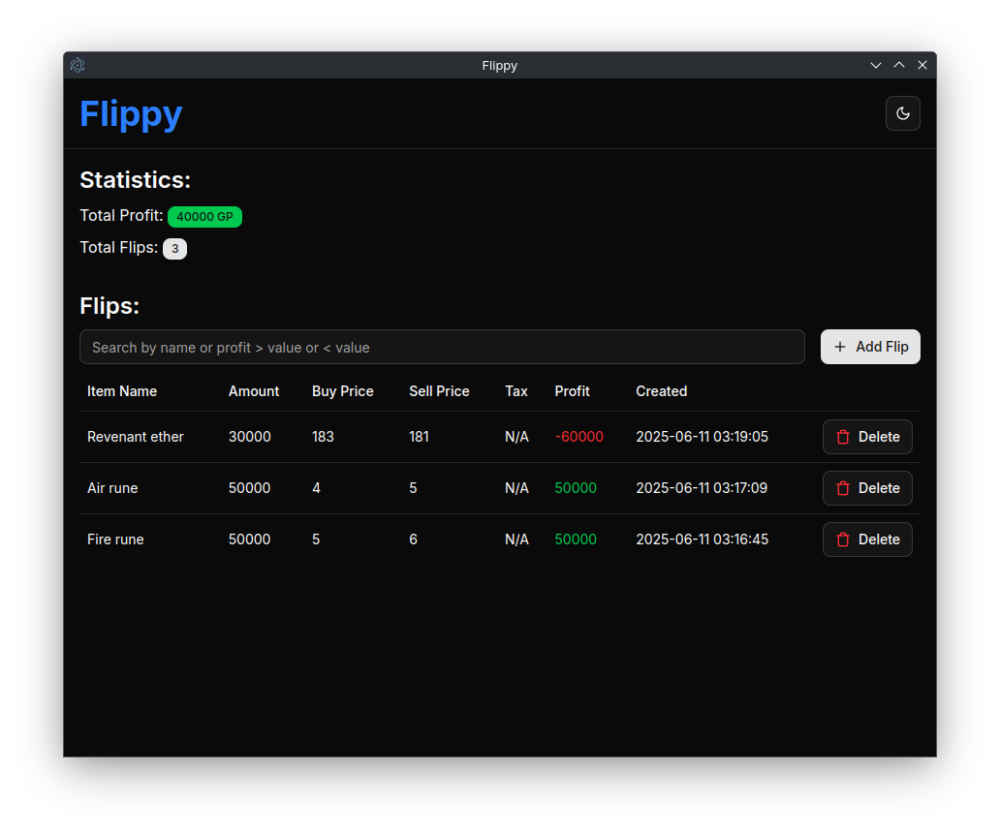

# Flippy

A cross-plattform desktop app to track your flips in the game Old School RuneScape. Built with Electron, React+shadcn/ui and SQLite.



[Download the latest release now!](https://github.com/enginkarakurt/flippy/releases/latest)

## Features

- Free forever
- Simple to use
- Entirely Offline

## Recommended IDE Setup

- VSCode + ESLint + Prettier

## Project Setup

### Install

```bash
$ npm install
```

### Development

```bash
$ npm run dev
```

### Build

```bash
# For Windows
$ npm run build:win

# For macOS
$ npm run build:mac

# For Linux
$ npm run build:linux
```
